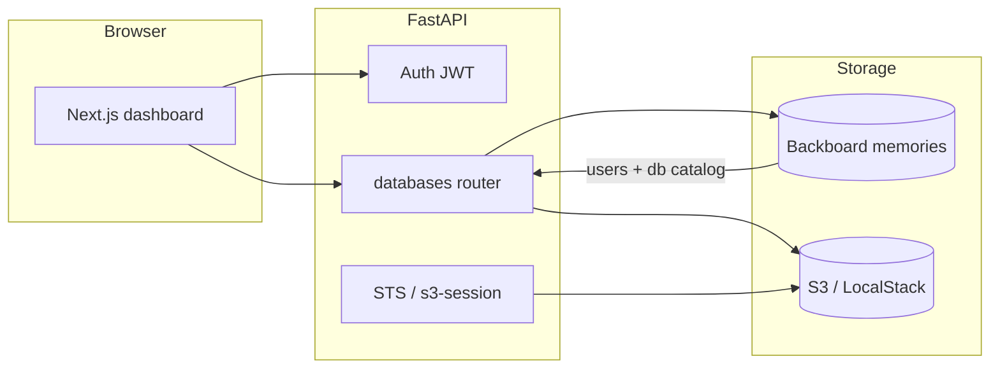

<div align="center">

<a href="assets/banner.png">
  
</a>

### **SQLite that sleeps in S3 and wakes up when you query it.**

*Your data is a file. Your file lives in a bucket. Your app just runs SQL.*

[](https://fastapi.tiangolo.com/)
[](https://nextjs.org/)
[](https://pypi.org/project/distributed-sqlite/)
[](https://backboard.io)

<br/>


<sub>Click the banner for the full image · art lives in <code>assets/</code></sub>

</div>

---

## The 12-second pitch

**LightLoft** is a tiny control plane for **tenant-isolated SQLite databases** backed by **S3**. Sign up, spin a database, run SQL over the API or wire up the Python **`db-host-client`** for **STS-minted** direct access. User accounts and catalog metadata live in **[Backboard](https://backboard.io)**; the heavy bytes stay in your bucket. Local dev uses **LocalStack** so you never need a credit card to try the full loop.

If you’ve ever wanted “Postgres ergonomics-ish, but actually just SQLite and an object store,” welcome home.

---

## Why it feels like magic

| Moment | What happens |
|--------|----------------|
| You click **Create** | A UUID, an API key (once), and an S3 prefix appear. The universe assigns you a namespace. |
| You run `SELECT 1` | **distributed-sqlite** talks to S3 like it’s a page cache with opinions. |
| You download `.env` | Sensible defaults for `curl`, JWT, and the SDK—no archaeology. |
| You mint an API key | The broker issues **short-lived S3 credentials** scoped to *your* prefix—neighbor tenants never see your keys. |

---

## Architecture (the honest version)



- **Frontend** (`web/`): Next.js 16, React 19, Tailwind, shadcn-flavored UI—**LightLoft** branding and dashboard.
- **API** (`api/`): FastAPI, Pydantic models everywhere, bcrypt + JWT for humans, per-database API keys for machines.
- **SDK** (`sdk/`): Exchange API key → STS session → SQLAlchemy engine (`distributed_sqlite` dialect).

---

## Quickstart

### Prerequisites

- **Docker** (for LocalStack)
- **[uv](https://docs.astral.sh/uv/)** (Python 3.12+)
- **Node.js** + npm (for the dashboard)
- **`awslocal`** recommended ([LocalStack docs](https://docs.localstack.cloud/user-guide/integrations/aws-cli/)) so `./start.sh` can create the dev bucket without friction

### 1. Configure

```bash
cp .env.example .env
```

Fill at least **`BACKBOARD_API_KEY`** and a strong **`JWT_SECRET`**. After the first successful run, put **`BACKBOARD_ASSISTANT_ID`** in `.env` when the app prints it—*that assistant holds your platform metadata; treat it like production data.*

See [`.env.example`](.env.example) for LocalStack vs real AWS toggles.

### 2. Launch everything

```bash
chmod +x start.sh
./start.sh
```

`start.sh` clears **local build/runtime junk only** (never your `.env`), starts LocalStack, bootstraps IAM for STS in dev, runs the API on **:8000**, and the app on **:3000**. `Ctrl+C` tears it all down cleanly.

| URL | What |
|-----|------|
| http://localhost:3000 | LightLoft dashboard |
| http://localhost:8000/docs | Interactive OpenAPI |
| http://localhost:8000/health | Sanity check |
| http://localhost:4566 | LocalStack |

### 3. Do the thing

1. Sign up / sign in.
2. Create a database—**save the API key**; it’s shown once.
3. Run SQL from the UI or `POST /databases/{id}/execute` with your JWT.
4. Grab the downloadable **`.env`** from the dashboard for copy-paste client setup.

---

## API cheat sheet

| Method | Path | Notes |
|--------|------|------|
| `POST` | `/auth/signup` | Returns JWT |
| `POST` | `/auth/signin` | Returns JWT |
| `GET` | `/databases` | List yours |
| `POST` | `/databases` | Create (+ `api_key` in response) |
| `POST` | `/databases/{id}/execute` | Body: `{"statements":["SELECT 1"]}` |
| `POST` | `/databases/{id}/api-key` | Rotate machine credential |
| `POST` | `/databases/s3-session` | Body: `{"api_key":"..."}` → STS for SDK |
| `GET` | `/databases/{id}/env` | Download client template |
| `DELETE` | `/databases/{id}` | Gone |

Admin routes under `/admin/*` unlock when your sign-in email appears in **`ADMIN_EMAILS`** in `.env` (comma-separated list, case-insensitive).

---

## Python SDK (direct S3 path)

From the repo:

```bash
cd sdk && uv sync
uv run python -c "
from sqlalchemy import text
from db_host_client import connect

with connect(api_key='YOUR_KEY') as engine:
    with engine.connect() as conn:
        print(conn.execute(text('SELECT 1')).scalar_one())
"
```

The API brokers **scoped** credentials so each tenant’s engine only sees its prefix.

---

## Project layout

```
db_host/
├── api/           # FastAPI app — all business logic lives here
├── assets/        # Logo & banner (LightLoft brand art)
├── web/           # Next.js dashboard
├── sdk/           # db-host-client (STS + SQLAlchemy)
├── scripts/       # LocalStack STS bootstrap, E2E helpers
├── docker-compose.yml
├── start.sh       # One command dev environment
└── .env.example
```

---

## Troubleshooting (the hits)

- **Port 8000 already in use** — Another uvicorn is squatting; `start.sh` exits on purpose. Free the port and rerun.
- **CORS weirdness on 500** — This API keeps unhandled errors inside the exception handler so browsers still get ACAO headers; check API logs and `api/runtime_trace.log`.
- **STS / `s3-session` 503** — Set **`DB_HOST_S3_ASSUMABLE_ROLE_ARN`**; `./start.sh` sets it for LocalStack after `scripts/bootstrap-localstack-sts.sh`.

---

## Philosophy

- **Single-purpose functions**, Pydantic at the boundaries, **no spooky fallbacks**.
- **Secrets and assistant IDs** stay in `.env`—never committed.
- **Logic in the API**; the UI is a polite messenger.

---

<div align="center">

**Built for people who love SQLite and distrust managing servers.**

*If this README made you smile, star the repo and go break something in dev—it’s what LocalStack is for.*

</div>
